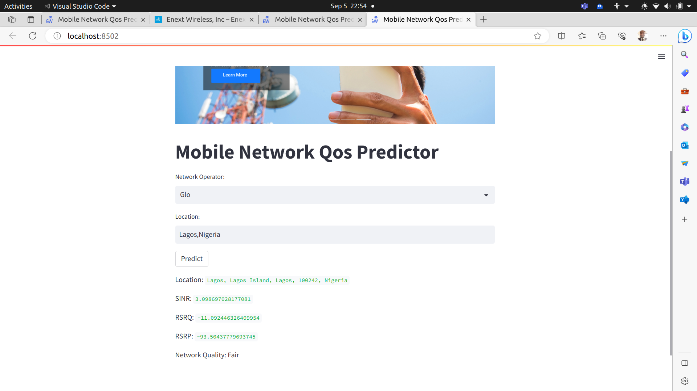

# Network Performance-QOS-Predictor

To use

1. clone This repository

2. navigate  or cd into the directory called  Network Performance-QOS-Predictor

3. pip install requirements.txt

4. streamlit run app.py

5. Enjoy the app

This is a product from Enextwireless that predicts your mobile network quality based on your location.Prediction Applicable only to **some states in Nigeria and in the US ALONE** based on data collected from that location. To use, Select Either MTN,AIrtel or glo if you are in Nigeria and select AT&T or Verizon or T Mobile if you are in US. A prediction of unknown occurs because the model hasn't been trained with network communication performance metrics data from your location. Other networks coming soon in the next version.

Below is a sample of prediction

